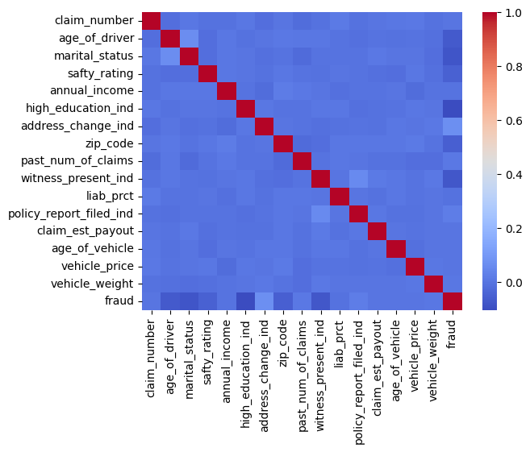
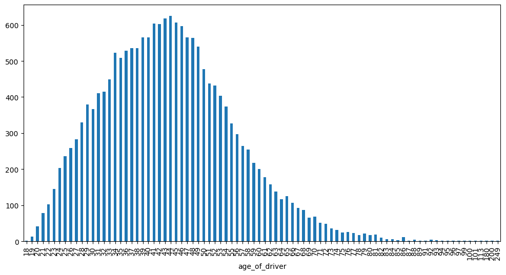
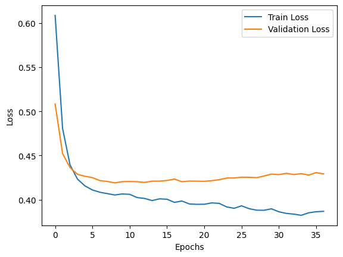
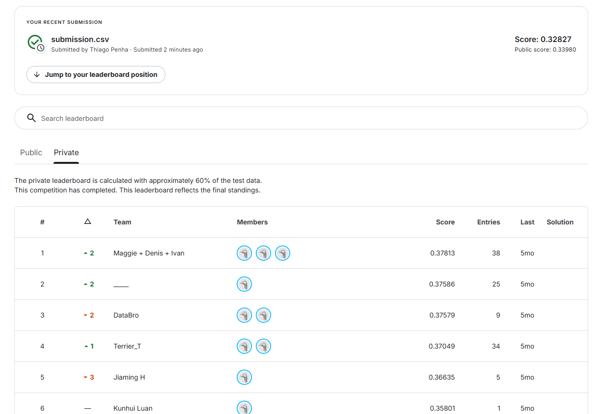
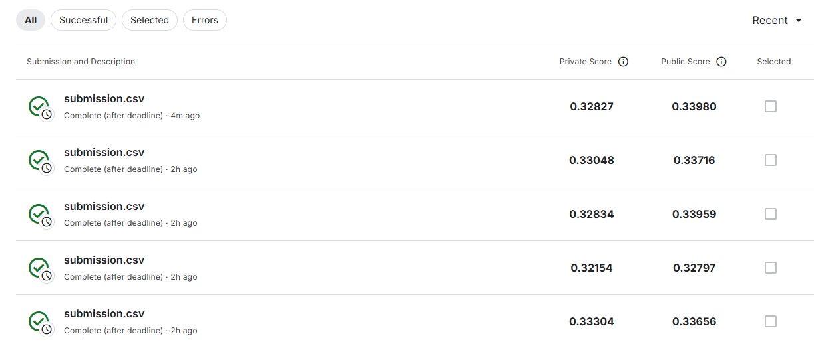

# Projeto de Classificação

O objetivo é desenvolver uma MLP para um problema de classificação

## Explicando o dataset selecionado

[Link para o dataset selecionado](https://www.kaggle.com/competitions/2025-ness-statathon/overview)

Como problema de classificação foi escolhido o problema de detecção de fraudes no seguro de veículos. O objetivo é desenvolver um modelo que detecte fraudes a partir de dados históricos. Como features temos informações a respeito do motorista e do veículo, sendo o target a coluna *"fraud"*

| **Variável**              | **Descrição**                                                  |
| ------------------------- | -------------------------------------------------------------- |
| `claim_number`            | ID da reclamação (não pode ser usado no modelo)                |
| `age_of_driver`           | Idade do motorista                                             |
| `gender`                  | Gênero do motorista                                            |
| `marital_status`          | Estado civil do motorista                                      |
| `safty_rating`            | Índice de segurança do motorista                               |
| `annual_income`           | Renda anual do motorista                                       |
| `high_education_ind`      | Indicador de nível educacional elevado do motorista            |
| `address_change_ind`      | Indica se o motorista mudou de endereço no último ano          |
| `living_status`           | Situação de moradia do motorista (própria ou alugada)          |
| `zip_code`                | CEP do endereço de residência do motorista                     |
| `claim_date`              | Data da primeira notificação da reclamação                     |
| `claim_day_of_week`       | Dia da semana da primeira notificação da reclamação            |
| `accident_site`           | Local do acidente (rodovia, estacionamento ou via local)       |
| `past_num_of_claims`      | Número de reclamações feitas pelo motorista nos últimos 5 anos |
| `witness_present_ind`     | Indicador de presença de testemunha no acidente                |
| `liab_prct`               | Percentual de responsabilidade na reclamação                   |
| `channel`                 | Canal de compra da apólice                                     |
| `policy_report_filed_ind` | Indicador de relatório de apólice registrado                   |
| `claim_est_payout`        | Valor estimado do pagamento da reclamação                      |
| `age_of_vehicle`          | Idade do veículo do segurado                                   |
| `vehicle_category`        | Categoria do veículo do segurado                               |
| `vehicle_price`           | Preço do veículo                                               |
| `vehicle_color`           | Cor do veículo                                                 |
| `vehicle_weight`          | Peso do veículo                                                |
| `fraud`                   | Indicador de fraude (0 = não, 1 = sim)                         |

Os principais problemas identificados foram a presença de alguns valores nulos para status de casamento e presença de testemunhas, de modo a resolver isso, substitui os valores que faltavam pela mediana das respectivas colunas. Além disso, outra dificuldade observada foi o desbalanceamento entre fraudes positivas e negativas, cerca de 16% dos dados apenas representam fraudes. 

### Descrição estatística dos dados

| Variável                    |  count |      mean |       std |       min |       25% |       50% |        75% |        max |
| --------------------------- | -----: | --------: | --------: | --------: | --------: | --------: | ---------: | ---------: |
| **claim_number**            | 18 000 | 15 028.41 |  8 682.69 |      1.00 |  7 435.75 | 15 099.00 |  22 539.25 |  29 999.00 |
| **age_of_driver**           | 18 000 |     43.70 |     12.01 |     18.00 |     35.00 |     43.00 |      51.00 |     249.00 |
| **marital_status**          | 17 998 |      0.71 |      0.45 |      0.00 |      0.00 |      1.00 |       1.00 |       1.00 |
| **safty_rating**            | 18 000 |     73.54 |     15.45 |      1.00 |     65.00 |     76.00 |      85.00 |     100.00 |
| **annual_income**           | 18 000 | 77 282.03 | 27 477.13 | 30 015.00 | 53 276.00 | 77 141.50 | 101 196.25 | 124 993.00 |
| **high_education_ind**      | 18 000 |      0.70 |      0.46 |      0.00 |      0.00 |      1.00 |       1.00 |       1.00 |
| **address_change_ind**      | 18 000 |      0.57 |      0.49 |      0.00 |      0.00 |      1.00 |       1.00 |       1.00 |
| **zip_code**                | 18 000 | 49 866.89 | 29 170.74 |      0.00 | 20 111.00 | 50 027.00 |  80 038.00 |  85 083.00 |
| **past_num_of_claims**      | 18 000 |      3.61 |      5.59 |      0.00 |      0.00 |      0.00 |       6.00 |      43.00 |
| **witness_present_ind**     | 17 868 |      0.24 |      0.43 |      0.00 |      0.00 |      0.00 |       0.00 |       1.00 |
| **liab_prct**               | 18 000 |     49.90 |     33.65 |      0.00 |     18.00 |     50.00 |      82.00 |     100.00 |
| **policy_report_filed_ind** | 18 000 |      0.60 |      0.49 |      0.00 |      0.00 |      1.00 |       1.00 |       1.00 |
| **claim_est_payout**        | 18 000 |  1 983.33 |  2 918.22 |      0.00 |      0.00 |      0.00 |   3 363.14 |  21 504.28 |
| **age_of_vehicle**          | 18 000 |      3.08 |      3.56 |      1.00 |      1.00 |      1.00 |       4.00 |      20.00 |
| **vehicle_price**           | 18 000 | 30 724.32 | 20 928.05 | 15 000.00 | 15 000.00 | 19 491.35 |  42 339.72 | 130 000.00 |
| **vehicle_weight**          | 18 000 | 22 940.26 | 12 088.90 |  2 450.14 | 13 977.99 | 20 714.32 |  29 366.56 | 123 016.65 |
| **fraud**                   | 18 000 |      0.16 |      0.36 |      0.00 |      0.00 |      0.00 |       0.00 |       1.00 |

Além dessa descrição analisei também a matriz de correlação entre as variáveis: 


*Matriz que mostra a correlação entre as variáveis*

Por fim, achei interessante mostrar esse gráfico da distribuição de idades:


*Gráfico que mostra a distribuição das idades dos motoristas*

## Pré-processamento dos dados

Acho interessante apontar que no gráfico mostrado na secção anterior é possível observar algumas idades improváveis, existem motoristas com mais de 110 anos. De modo a remediar isso, foi aplicada a mediana a todos os motoristas que assinalaram que possuem mais de 110 anos, visando reduzir o impacto desses ruídos na distribuição das idades.

Além desse caso, não houveram mais problemas que necessitassem limpeza dos dados. Desse modo, parti para a normalização dos dados. Para os valores numéricos optei pelo min-max scaler, de modo a manter a distribuição original dos dados. Já para os valores categóricos, optei pelo one-hot encoding, de modo a evitar um possível viés causado pelo label encoder (no caso do modelo atribuir uma ordem aos valores atribuídos).

Por fim, após aplicar o One-Hot Encoding, o dataset ficou com 773 colunas, desse modo decidi aplicar um PCA para diminuir a dimensionalidade dos dados. Acabei mantendo 95% da variância, o que me resultou em 441 colunas.

---

## Implementação da MLP

Para a etapa de modelagem, optei por utilizar a biblioteca **PyTorch**. Apesar de o enunciado permitir a implementação manual de uma MLP “from scratch”, a utilização do PyTorch foi escolhida pela sua clareza na estruturação de redes neurais e facilidade para controlar etapas como treino, validação e uso de GPU.

A arquitetura da rede foi implementada manualmente com o módulo `torch.nn`, o que ainda exige compreender cada parte do processo — camadas lineares, funções de ativação, função de perda e otimizador. A estrutura final utilizada foi:

```python
import torch
import torch.nn as nn

class MLP(nn.Module):
    def __init__(self, input_dim):
        super(MLP, self).__init__()
        self.layers = nn.Sequential(
            nn.Linear(input_dim, 64),
            nn.ReLU(),
            nn.Linear(64, 32),
            nn.ReLU(),
            nn.Linear(32, 1),
            nn.Sigmoid()
        )
    def forward(self, x):
        return self.layers(x)
```

**Arquitetura final:**

* **Camadas:** 3 camadas lineares (input → 64 → 32 → 1)
* **Ativações:** ReLU nas camadas ocultas e Sigmoid na saída (por se tratar de um problema binário)
* **Função de perda:** Binary Cross-Entropy (`BCELoss`)
* **Otimizador:** Adam (`torch.optim.SGD`)
* **Batch size:** 64
* **Learning rate:** 0.001
* **Número máximo de épocas:** 500
* **Critério de parada:** early stopping com base na *val_loss*

O uso de PyTorch não impede a compreensão dos mecanismos internos — a rede realiza as mesmas operações básicas que uma MLP “from scratch”: multiplicação de matrizes, aplicação de funções de ativação e *backward propragation* de gradientes com base na perda.

---

## Estratégia de Treinamento

Para evitar overfitting e melhorar a generalização, foram utilizadas as seguintes práticas:

* **Divisão dos dados:** 45% treino e 15% validação e 40% teste. É importante ressaltar que o dataset do kaggle já era dividido em test(40%) e train(60%), dessa forma não havia a possibilidade de fazer uma divisão mais ótima e comum, como por exemplo (70,15,15).
* **Mini-batch training:** batches de 64 amostras para equilibrar estabilidade e velocidade.
* **Early stopping:** monitorando a *val_loss*, interrompendo o treinamento após 10 épocas sem melhora significativa (Delta < 1e-3).
* **Normalização:** já discutida, com *MinMaxScaler* para dados numéricos.
* **Codificação categórica:** *One-Hot Encoding* aplicado antes do PCA.

O loop de treinamento implementado incluiu:

1. **Forward pass**: o batch é passado pela MLP.
2. **Cálculo da perda**: `BCELoss` compara as predições com as labels verdadeiras.
3. **Backpropagation**: cálculo e atualização dos gradientes via `optimizer.step()`.
4. **Validação**: após cada época, a rede é avaliada no conjunto de validação e o early stopping monitora o progresso.

---

## Curvas de Treinamento

Durante o treinamento, foram armazenadas as curvas de perda de treino e validação.
O gráfico abaixo mostra a convergência do modelo e a ação do early stopping:


*Evolução das perdas de treino e validação ao longo das épocas.*

**Análise:**
Observa-se que a perda de treino diminui rapidamente.
A *val_loss* segue comportamento semelhante, mas com pequenas oscilações, indicando um bom ponto de parada automático após a convergência.
Não há sinais de overfitting significativo.

---

## Métricas de Avaliação

Após o treinamento, o modelo foi avaliado no conjunto de validação utilizando as métricas padrão de classificação binária.

| Métrica      | Valor |
| ------------ | ----: |
| **Acurácia** |  0.62 |
| **Precisão** |  0.24 |
| **Recall**   |  0.65 |
| **F1-Score** |  0.36 |

A escolha da métrica principal foi o **F1-Score**, devido ao desbalanceamento observado (apenas ~16% de fraudes).
O *threshold* foi ajustado automaticamente entre 0.01 e 0.99 para maximizar o F1 na validação. Foi escolhido o valor de 0.17, por ser o valor com maior f1 socre, a métrica usada na competição.

A matriz de confusão também foi analisada:

|            | Predito 0 | Predito 1 |
| ---------- | --------: | --------: |
| **Real 0** |      1403 |       870 |
| **Real 1** |       146 |       281 |

---

## Geração do Arquivo de Submissão

Para a inferência final sobre o conjunto de teste, foi necessário:

1. Aplicar **o mesmo PCA ajustado no treino**;
2. Converter os dados em tensor;
3. Executar a rede em modo `eval()` sem gradientes, de modo a obter a predição do modelo;
4. Aplicar o *threshold ótimo* encontrado na validação.

O resultado foi salvo como um CSV no formato exigido:

```python
submission = pd.DataFrame({
    'claim_number': df_test['claim_number'],
    'fraud': preds
})
submission.to_csv('submission.csv', index=False)
```

---

## Conclusão

O modelo MLP desenvolvido em **PyTorch** apresentou desempenho consistente para o problema de detecção de fraudes em seguros.
Mesmo utilizando técnicas clássicas (normalização, One-Hot Encoding e PCA), foi possível atingir bons resultados, com **F1-Score competitivo e bom equilíbrio entre precisão e recall**, apesar de não ser um valor alto de f1 (0.356) é importante notar que na competição o líder da competição obteve 0.378.



No ambiente de desenvolvimento, testando com os dados de validação obtive o resultado de 0.356, mas no kaggle meu valor final de f1 foi 0.328 para os valores *private* e 0.339 para o score público. 



Fiz alguns experimentos para tentar melhorar o modelo, observa-se que o melhor resultado foi a penúltima submissão, entretanto ela estava com muito over-fitting, o gráfico de aprendizagem mostrava que a loss do treino caía, mas a loss de validação continuava subindo.

Todos os códigos mencionados nesse relatório podem ser encontrados em:

[Arquivo de Desenvolvimento no GitHub](https://github.com/tpenha05/Entregas_Redes_ML/blob/main/notebooks/project1/project1.ipynb)