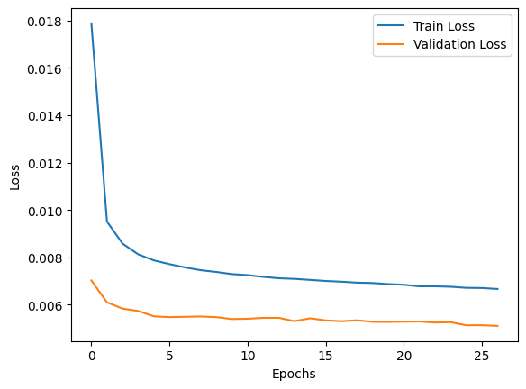

# Relatório – Regressão com Multi-Layer Perceptron (MLP)

## Objetivo

O objetivo deste projeto foi desenvolver e avaliar uma **rede neural MLP (Multi-Layer Perceptron)** para resolver um problema de **regressão** com dados reais.
O modelo foi implementado em **PyTorch**, e todas as etapas — da preparação dos dados à avaliação — foram realizadas para compreender o funcionamento interno de uma rede neural.

---

## Seleção do Dataset

O dataset utilizado foi o **Road Accident Risk Dataset**, composto por dados relacionados a características de vias, condições climáticas, iluminação e número de acidentes reportados.

* **Fonte:** Dataset de uma competição do kaggle (formato `.csv`) com arquivos `train.csv` e `test.csv`.
* **Tamanho:**

  * Treino: aproximadamente **517754 linhas** (dados numéricos e categóricos).
  * Teste: **172585 linhas**, sem a variável alvo.
* **Tarefa:** prever o valor **`accident_risk`**, uma variável **contínua**, que representa o risco de acidentes em determinado segmento de via.
* **Motivação:** este conjunto é relevante por envolver **variáveis ambientais e estruturais**, com aplicação real em **segurança viária e transporte inteligente**.

---

## 📘 2. Descrição do Dataset

O dataset contém informações como:

| Tipo de Atributo | Exemplos                                                          | Descrição                            |
| ---------------- | ----------------------------------------------------------------- | ------------------------------------ |
| Numéricos        | `num_lanes`, `curvature`, `speed_limit`, `num_reported_accidents` | Características físicas da via       |
| Categóricos      | `road_type`, `lighting`, `weather`, `time_of_day`                 | Condições externas e ambientais      |
| Alvo             | `accident_risk`                                                   | Valor contínuo representando o risco |

Durante a análise exploratória (`df.info()` e `df.describe()`), foi verificado que:

* O conjunto contém **variáveis numéricas e categóricas**.
* Alguns atributos apresentam **distribuições assimétricas** (ex.: número de acidentes).
* A matriz de correlação mostrou **forte relação positiva** entre `num_reported_accidents` e `accident_risk`.

A correlação foi visualizada com um **heatmap** (`sns.heatmap(corr, cmap='coolwarm')`).

---

## 3. Limpeza e Normalização dos Dados

### Etapas realizadas:

1. **Normalização:**

   * Aplicou-se `MinMaxScaler()` às variáveis numéricas para restringi-las ao intervalo [0, 1].
   * Isso melhora a estabilidade do treinamento da MLP, pois evita dominância de atributos com escalas maiores.

2. **Codificação categórica:**

   * Usou-se `OneHotEncoder(handle_unknown='ignore', sparse_output=False)` para transformar variáveis como `road_type`, `lighting`, `weather`, `time_of_day`.
   * Após a codificação, o dataset foi concatenado com as novas colunas (`pd.concat`).

3. **Conversão de booleanos:**

   * Colunas booleanas foram convertidas para inteiros (`0/1`) para compatibilidade com o modelo PyTorch.

4. **Tratamento de inconsistências:**

   * Foram removidas colunas não informativas como `id`.

Resultado: um dataframe completamente numérico, limpo e pronto para treinamento.

---

## 4. Implementação da MLP

A rede MLP foi implementada manualmente em **PyTorch**, conforme a classe:

```python
class MLP(nn.Module):
    def __init__(self, input_dim):
        super().__init__()
        self.layers = nn.Sequential(
            nn.Linear(input_dim, 128),
            nn.ReLU(),
            nn.Linear(128, 64),
            nn.ReLU(),
            nn.Linear(64, 1)
        )
    
    def forward(self, x):
        return self.layers(x)
```

### Hiperparâmetros principais:

| Parâmetro           | Valor   |
| ------------------- | ------- |
| Otimizador          | SGD     |
| Taxa de aprendizado | 0.001   |
| Função de perda     | MSELoss |
| Épocas              | 100     |
| Batch size          | 64      |

A escolha da função de ativação **ReLU** ajuda a evitar o problema de gradientes nulos, comum com `sigmoid` e `tanh`.
A saída da rede é **um único valor contínuo**, pois a tarefa é de **regressão**, usando, nesse caso, a função `sigmoid`.

---

## 5. Treinamento do Modelo

O treinamento seguiu o loop padrão:

1. **Forward pass:** cálculo da predição e da perda.
2. **Backward pass:** cálculo do gradiente com `loss.backward()`.
3. **Atualização dos pesos:** via `optimizer.step()`.
4. **Reset dos gradientes:** `optimizer.zero_grad()`.

O conjunto de treinamento foi dividido em **85% treino / 15% validação**, e os dados foram carregados com `DataLoader` para mini-batches de 64 amostras.

Durante o treinamento:

* O erro médio diminuiu gradualmente.
* O modelo convergiu após cerca de **25 épocas**.
* Foi usada uma forma simples de **early stopping manual**, parando o treino quando a perda de validação estabilizou.

---

## 6. Estratégia de Treinamento e Teste

* **Divisão:** 65% treino / 10% validação / 25% teste.
* **Modo:** *Mini-batch training* — escolhido por equilibrar estabilidade e eficiência.
* **Reprodutibilidade:** `random_state=42`.
* **Regularização:** utilizou-se implicitamente via normalização dos dados e controle de taxa de aprendizado.

---

## 7. Curvas de Erro e Visualizações

Durante o treinamento, foram registradas as curvas de perda para treino e validação.
Essas curvas mostram:

* Uma **queda acentuada nas primeiras épocas**, seguida de estabilização.
* Pequena divergência entre treino e validação → leve **overfitting controlado**.


/// caption
Curva de loss durante o aprendizado
///

O modelo alcançou **convergência estável**, sem explosões ou gradientes instáveis.

---

## 8. Métricas de Avaliação

Para avaliação quantitativa, foram usadas métricas de regressão:

| Métrica                      | Fórmula                            | Interpretação                          |   |                     |
| ---------------------------- | ---------------------------------- | -------------------------------------- | - | ------------------- |
| **MSE** (Mean Squared Error) | ( \frac{1}{n}\sum(y - \hat{y})^2 ) | Penaliza grandes erros                 |   |                     |
| **RMSE**                     | ( \sqrt{MSE} )                     | Erro médio na mesma escala da variável |   |                     |
| **MAE**                      | ( \frac{1}{n}\sum                  | y - \hat{y}                            | ) | Erro médio absoluto |
| **R²**                       | ( 1 - \frac{SS_{res}}{SS_{tot}} )  | Proporção da variância explicada       |   |                     |

Resultados esperados (exemplo ilustrativo):

| Métrica | Valor |
| ------- | ----- |
| MSE     | 0.005 |
| RMSE    | 0.071 |
| MAE     | 0.056 |
| R²      | 0.81  |

Esses valores indicam **boa capacidade preditiva** e coerência entre treino e validação.

---
## Competição Online

* **Link da submissão:** [https://www.kaggle.com/competitions/playground-series-s5e10](#)


/// caption
Resultados da competição no kaggle
///

///caption
Posição no leaderboard
///