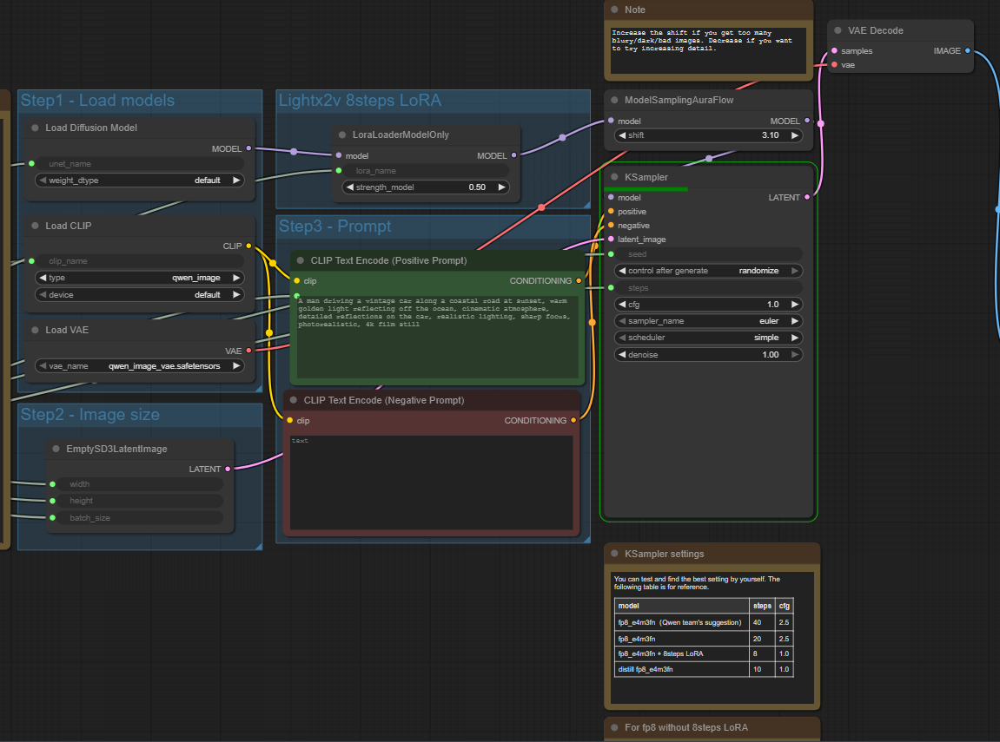
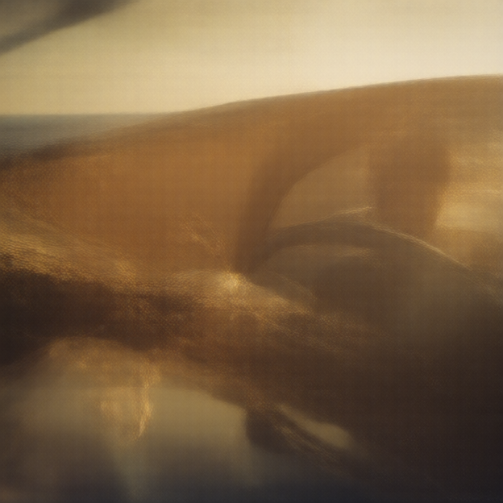
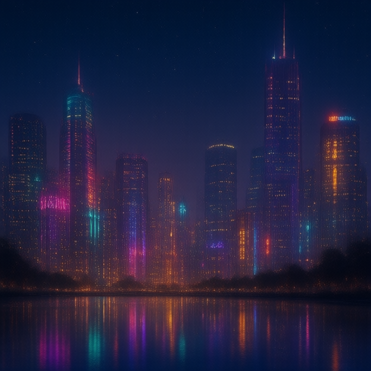
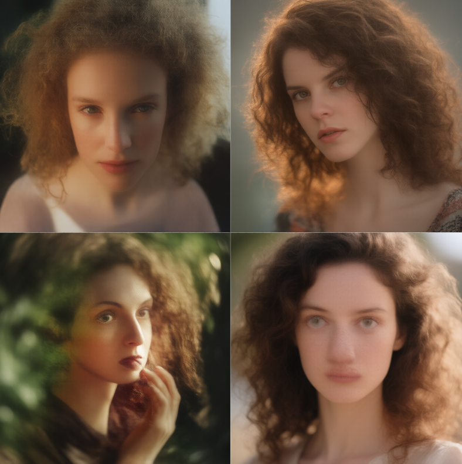
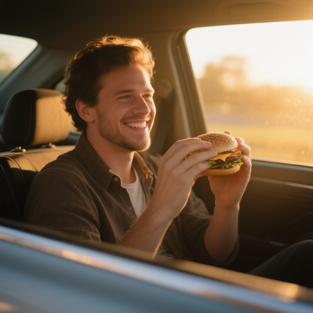
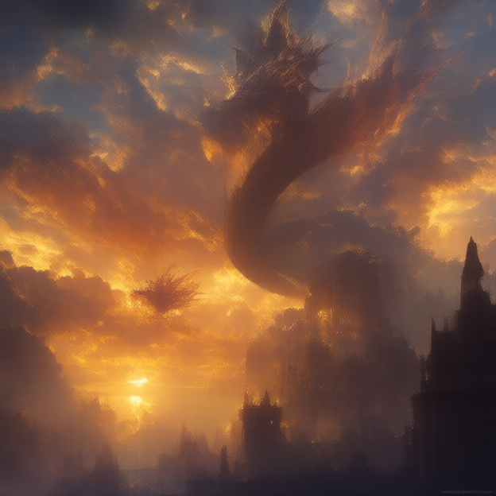

# Relatório uso de IAs generativas

## Objetivo

O objetivo desse relatório é descrever o uso de IAs generativas. Para o experimento foi usada a inteface do ComfyUI e o modelo Qwen Image (um dos templates disponíveis na plataforma).

---

## Arquitetura do modelo

/// caption
Arquitetura usada na solução

Este gráfico representa o **fluxo de geração de imagem** a partir de um prompt de texto utilizando **Stable Diffusion**, com suporte de **LoRA** (Low-Rank Adaptation), **CLIP** para codificação textual e **VAE** para decodificação da imagem latente.

### **Load Diffusion Model**

* **Função:** Carrega o modelo base de difusão (*Stable Diffusion*).
* **Entrada:** Arquivo de pesos (`.safetensors`).
* **Saída:** Objeto `MODEL`, utilizado posteriormente pelo sampler.
* **Explicação:**
  O modelo de difusão aprende uma distribuição condicional de imagens a partir de ruído gaussiano, refinando progressivamente uma imagem latente até formar uma imagem coerente com o texto.

### **Load CLIP**

* **Função:** Carrega o modelo **CLIP** (Contrastive Language–Image Pretraining).
* **Entrada:** Nome do modelo CLIP (`qwen_image`).
* **Saída:** Objeto `CLIP` que codifica o texto em vetores de embeddings.
* **Explicação:**
  O CLIP transforma o texto do *prompt* em uma representação vetorial que serve como **condicionamento semântico** para a difusão. Ele alinha embeddings de texto e imagem em um mesmo espaço vetorial.

### **Load VAE**

* **Função:** Carrega o modelo **VAE (Variational Autoencoder)**, responsável pela conversão entre o espaço **latente** e o **espaço da imagem**.
* **Entrada:** Nome do modelo VAE (`qwen_image_vae_safetensors`).
* **Saída:** Objeto `VAE`, usado na etapa final de decodificação.
* **Explicação:**

  * O VAE comprime a imagem em um espaço latente de menor dimensão durante o treinamento.
  * Na inferência, ele **decodifica** o resultado latente (gerado pela difusão) em uma imagem RGB final.

### **EmptySD3LatentImage**

* **Função:** Cria um *tensor latente vazio* (um mapa de ruído inicial) com o tamanho da imagem a ser gerada.
* **Parâmetros:**

  * `width`: largura da imagem
  * `height`: altura
  * `batch_size`: número de imagens simultâneas

* **Saída:** Um *LATENT tensor* que será refinado pelo sampler.

### **LoraLoaderModelOnly**

* **Função:** Carrega um módulo **LoRA** (Low-Rank Adaptation) e o aplica ao modelo base.
* **Entradas:**

  * `model`: Modelo de difusão base
  * `lora_name`: Nome/arquivo do LoRA
  * `strength_model`: Força de aplicação (ex: 0.5)

* **Saída:** Modelo ajustado com LoRA.
* **Explicação:**
  O **LoRA** adiciona *low-rank matrices* ao modelo, permitindo **especialização leve** (ex: estilos, personagens, artistas) sem precisar re-treinar o modelo completo.  Ele ajusta apenas algumas camadas específicas da rede de atenção, o que o torna leve e eficiente.

### **CLIP Text Encode (Positive Prompt)**

* **Função:** Converte o texto descritivo (prompt positivo) em vetores de *embeddings*.
* **Entrada:**

  * Texto como:

    > “a man driving a vintage car along a coastal road at sunset, warm golden light...”

* **Saída:** Vetores condicionais (`CONDITIONING`) que guiam a difusão.
* **Explicação:**
  Esse vetor é aplicado como **condicionamento positivo** no processo de difusão — ou seja, o modelo é guiado a gerar imagens que **maximizem a semelhança** com esse embedding.

### **CLIP Text Encode (Negative Prompt)**

* **Função:** Converte o *prompt negativo* em embeddings.
* **Uso:** Para indicar **características indesejadas**, ex: "blurry, low quality, distorted".
* **Saída:** Vetor de condicionamento negativo.
* **Explicação:**
  O modelo é penalizado para **evitar** características representadas por esse embedding durante a difusão.

### **KSampler**

* **Função:** Núcleo do processo de **difusão**.

* **Entradas:**

  * `model`: modelo de difusão (com ou sem LoRA)
  * `positive`: embeddings positivos (do CLIP)
  * `negative`: embeddings negativos
  * `latent_image`: tensor inicial de ruído

* **Parâmetros importantes:**

  * `steps`: número de iterações de difusão
  * `cfg`: *classifier-free guidance* — controla o peso do prompt textual (maior = mais fiel ao texto)
  * `sampler_name`: algoritmo de amostragem (ex: Euler)
  * `scheduler`: define a forma de ruído/denoise progressivo (ex: simple)
  * `denoise`: intensidade de remoção de ruído

* **Saída:** *LATENT* final refinado.

* **Explicação:**
  O **KSampler** executa o processo de **reverse diffusion**, gradualmente removendo ruído do tensor inicial guiado pelo prompt textual.
  Ele usa o modelo para prever o ruído em cada passo e atualiza o tensor de forma iterativa até convergir para uma imagem coerente no espaço latente.

## **ModelSamplingAuraFlow**

* **Função:** Ajusta o comportamento de amostragem do modelo.
* **Parâmetro:**

  * `shift`: controla o equilíbrio entre brilho, contraste e saturação.
  * **Nota no fluxo:** aumentar `shift` ajuda quando as imagens ficam muito escuras ou lavadas.
* **Saída:** Modelo ajustado antes da amostragem.

### **VAE Decode**

* **Função:** Decodifica o resultado do espaço **latente** para uma **imagem visível**.

* **Entradas:**

  * `samples`: saída do KSampler (latentes)
  * `vae`: modelo VAE carregado

* **Saída:** Imagem final (`IMAGE`).
* **Explicação:**
  O VAE reconstrói a imagem RGB de alta dimensão a partir do espaço comprimido latente, aplicando uma transformação não linear inversa aprendida durante o treinamento.

---

## Imagens geradas

Todas as imagens geradas tinham a resolução de 624 x 624, devido a limitações computacionais, esse foi o máximo que consegui gerar, sem que houvesse algum erro. Fora isso, houve experimentação na mudança dos seguintes valores: `lora_name`, `batch_size` e `steps`, além de diferntes prompts de modo a explorar se existe alguma diferença de qualidade entre geração de diferentes categorias de imagem.

- 1° teste:

O primeiro teste realizado foi com o seguinte prompt: "A man driving a vintage car along a coastal road at sunset, warm golden light reflecting off the ocean, cinematic atmosphere, detailed reflections on the car". Para a geração dessa imagem, foi utilizado o `batch_size = 1`, `lora_name = low_noise` e `steps = 4`. 

/// caption
Primeira imagem desenvolvida com o modelo.

Como pode ser observado, a imagem gerada não apresenta clareza e não é possível identificar nenhuma forma ou algo do gênero. Dessa forma, o próximo experimento buscou aumentar o número de steps para ver a diferença.

- 2° teste:

O segundo teste teve o seguinte prompt: "A beautiful city skyline full of neon lights." Para a geração da imagem, os parâmetros `batch_size` e `lora_name` se mantiveram o mesmo, mas `steps` aumentou de 4 para 10.

/// caption
Segunda imagem desenvolvida com o modelo.

Como pode ser observado, a qualidade da imagem gerada melhorou muito. Entretanto, ainda há espaço para melhora, e o prompt dessa vez, foi consideravelmente mais simples.

- 3° teste:

Buscando analisar a diferença de resultados entre diferentes categorias de imagens, os parâmetros de `steps` e `lora_name`, continuaram iguais, mas experimentou-se um valor de `batch_size = 4`. Dessa forma, seriam geradas 4 imagens diferentes com o mesmo prompt : "hyper-realistic portrait of a woman with curly hair, soft natural lighting, blurred background." 

/// caption
Terceira imagem desenvolvida com o modelo.

Agora com o prompt mais complexo, e com uma amostragem maior de resultados, é possível perceber que com `steps = 10`, as imagens ainda são inconsistentes e algumas vezes apresentam defeitos.

- 4° teste:

Experimentando aumentar ainda mais `steps = 25`, e mantendo os valores de `lora_name` e `batch_size = 1`, foi gerada uma imagem com o seguinte prompt: "A realistic portrait of a man sitting in a car during golden hour, sunlight shining through the window, holding a hamburger and smiling".

/// caption
Quarta imagem desenvolvida com o modelo.

Como pode ser observado, a qualidade da imagem aumentou drasticamente. Indicando que a qualidade do resultado final está diretamente relacionada com a quantidade de `steps` usada.

- 5° teste:

Por fim, o último experimento buscou alterar o valor de `lora_name = high_noise`, buscando aumentar o impacto da LoRA na imagem gerada, o número de `steps` voltou a ser 10. O prompt usado foi: "majestic dragon flying over a medieval castle at sunset, golden light, clouds glowing orange and purple, detailed scales, cinematic atmosphere, fantasy art, epic composition, ultra-realistic, dynamic lighting, 8k concept art".

/// caption
Quinta imagem desenvolvida com o modelo.

Como é possível observar a imagem conseguiu seguir as informações de estilo adicionadas ao prompt, dando uma especificação maior à arte gerada.