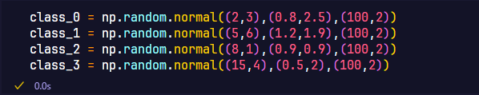
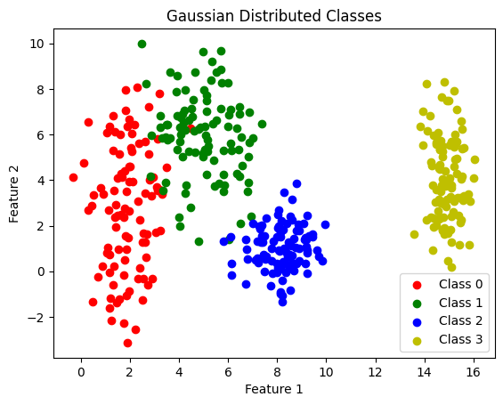
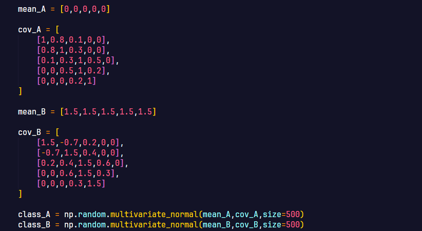
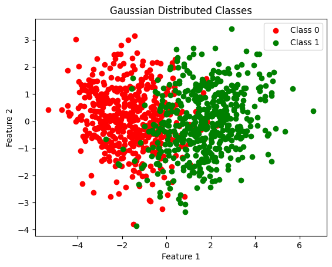
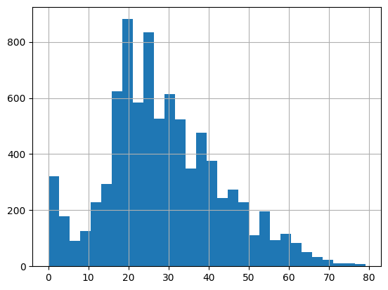
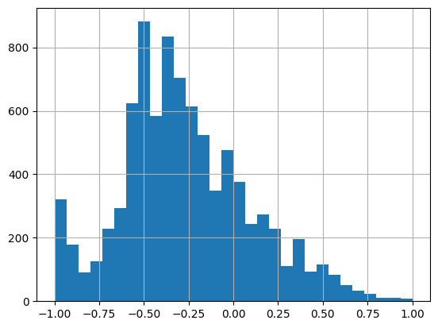
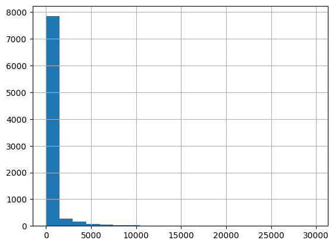
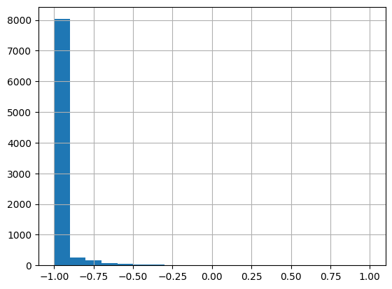

## Objetivo

Esta atividade foi feita para testar suas habilidades em gerar datasets sintéticos, lidando com problemas de dados do mundo real, e preparar dados para serem alimentados a *redes neurais*.

## Explorando a separabilidade de Dados em 2D

### Gerando os dados

/// caption
Código Numpy para gerar dados
///

### Plottando os dados 

/// caption
Scatter Plot dos dados
///

### Analisando e desenhando limites

Ao analisar o Scatter Plot gerado podemos perceber certa separação entre as classes, em especial 2 e 3. Isso se dá uma vez que a classe 3 possui um valor médio de X muito maior do que as outras, separando-a das demais e permitindo facilmente sua visualização. Já a classe 2, possui um desvio padrão muito baixo, fazendo com que os pontos fiquem mais agrupados que das demais, além disso seu X médio não é alcançado por muitas outras classes, com exceção de “outliers” da classe 1, que estejam próximo do limite do desvio padrão máximo. Por sua vez, as classes 1 e 2 possuem mais pontos de encontro, devido à proximidade gerada pelos altos valores de desvio padrão.

Não seria possível separar as 4 classes com um simples limite linear.

Baseado na análise realizada acima, uma possível separação para as classes seria: 

/// caption
Possível separação das classes
///

## Não Linearidade em mais dimensões 

### Gerando os dados

/// caption
Código Numpy para gerar dados
///

### PCA e plot dos dados

O PCA foi feito stackando as classes A e B horizontalmente e criando uma matriz de stack vertical com valores de 0 e 1, 0 representando o y da classe A e 1 para a classe B. Após isso foi feito o scatter plot abaixo:

/// caption
Scatter Plot após PCA
///

### Analisando o Gráfico

É possível observar que existe uma sobreposição considerável entre as duas classes, apesar de ser observada certa separação ao longo do eixo X, em que a classe A se concentra mais na esquerda, enquanto a classe B fica mais à direita, entretanto, o centro da imagem possui uma grande interseção das duas classes. Dessa forma a separabilidade linear sem erros desse tipo de dado é impossível, uma vez que o hiperplano gerado para separar essas duas classes não seria capaz de contornar e decidir corretamente as sobreposições, tornando assim uma rede neural de multi camadas mais adequada para essa tarefa.

## Preparando dados do mundo real para Redes Neurais

### Descrevendo os dados

O dataset tem o objetivo de prever se um passageiro foi transportado para uma dimensão alternativa após o titanic espacial colidir com uma anomalia espacial, fazendo com que a coluna transported seja o target da predição. As demais features são informações sobre os passageiros, que auxiliarão o modelo a fazer essa predição. 

#### Colunas do dataset

- PassengerId: é o índice do dataset, valor único que separa os passageiros

- HomePlanet: Dado *categórico*

- CryoSleep: Valor booleano, logo *categórico*

- Cabin: 

- Destination: Valor *categórico*

- Age: Valor *numérico*

- VIP: Valor booleano, logo *categórico*

- RoomService, FoodCourt, ShoppingMall, Spa, VRDeck: A quantidade que o passageiro gastou em cada um desses locais na embarcação, *numérico*

- Name: Valor *categórico*

- Transported : Valor booleano, logo *categórico*

#### Valores nulos

- PassengerId: 0 missing values

- HomePlanet: 201 missing values

- CryoSleep: 217 missing values

- Cabin: 199 missing values

- Destination: 182 missing values

- Age: 179 missing values

- VIP: 203 missing values

- RoomService: 181 missing values

- FoodCourt: 183 missing values

- ShoppingMall: 208 missing values

- Spa: 183 missing values

- VRDeck: 188 missing values

- Name: 200 missing values

- Transported: 0 missing values

### Preprocessamento dos dados

#### Lidando com valores nulos

Para as colunas numéricas, exceto idade, os valores nulos foram transformados em zero, uma vez que assumir qualquer outro valor como a média ou a mediana, assumiria que os passageiros gastaram nos espaços da embarcação, o que pra grande maioria dos tripulantes não é verdade. Já para a idade, foi aplicada substituição dos valores faltando pela mediana, para não termos valores não inteiros de idade, o que não faz sentido. Já para os valores categóricos aplicamos a moda aos valores que faltavam.

#### Codificando as features categóricas

Para as colunas categóricas foi aplicada a técnica de one-hot encoding, de modo a evitar implicar uma "ordem" aos dados. Apesar de que neste caso isso não faria tanta diferença, uma vez que por coluna haviam apenas 2 valores categóricos.

#### Normalização dos dados

Para os dados numéricos foi usado o MinMaxScaler do scikit-learn, com um range de -1 e 1, seguindo a função de ativação `tanh`, que flutua entre esses valores. A função do MinMaxScaler é fazer a normalização dos dados, nesse contexto. 

#### Resultados

Gráficos da distribuição de idade : 

/// caption
Histograma pré transformação
///

/// caption
Histograma pós transformação
///

Gráficos da distribuição de gastos na praça de alimentação : 

/// caption
Histograma pré transformação
///

/// caption
Histograma pós transformação
///
