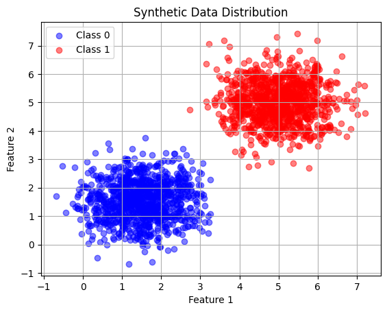
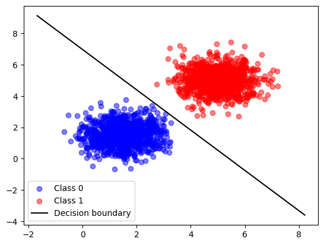
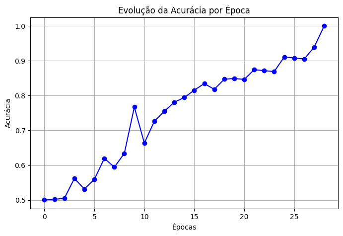
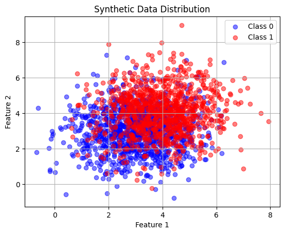
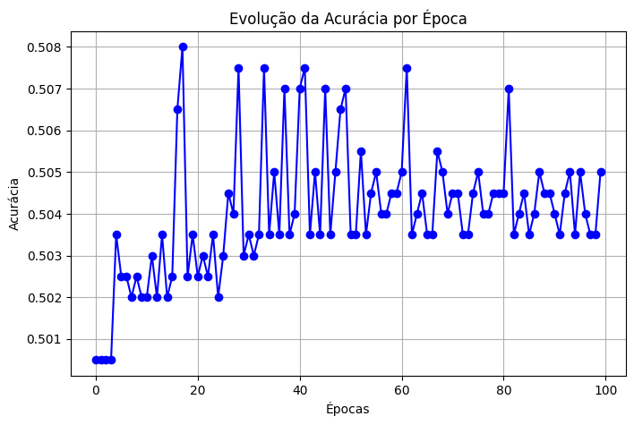

## Objetivo

O objetivo dessa atividade é criar um perceptron com apenas uma camada, e testar as limitações desse neurônio.

## Códigos

Todos os códigos utilizados para fazer esse roteiro podem ser encontrados no repositório, cujo link está na home page desse site. Especificamente para essa entrega, o notebook usado para gerar gráficos e fazer as transformações descritas abaixo pode ser encontrado no path:

```bash
# File Location

notebooks/entrega2/ex.ipynb
```
## Perceptron lidando com Dados Linearmente Separáveis

### Gerando os dados

Foram criadas duas classes, cada uma com 1000 amostras e com os seguintes parâmetros: 

- Class 0:
    Média = $[1.5, 1.5]$,

    Matriz de Covariância = $[[0.5, 0],[0, 0.5]]$.

- Class 1:
    Média = $[5, 5]$,

    Matriz de Covariância = $[[0.5, 0],[0, 0.5]]$.

#### Resultado 


/// caption
Scatter Plot dos dados
///

### Implementando o Perceptron

Foram inicializados o vetor de pesos ($[0, 0]$), o valor de bias (0) e a taxa de aprendizagem (0.01). Além disso, foi feito as classes criadas anteriormente foram unidas verticalmente, de modo a criar a variável X (dados de treino), e foi criada uma matriz Y com 2000 valores (1000 zeros e 1000 uns), representando o target para o neurônio. 

Após esses processos, podemos começar o treinamento do neurônio, no qual tivemos uma duração de 100 epochs, utilizando early stopping, quando ele conseguisse classificar o dataset inteiro corretamente, 1 epoch sem erros. Durante o treinamento, o neurônio percorria o dataset, e sua previsão era baseada na seguinte expressão:
```python

y_pred = 1 if ((X[n] @ w) + b) >= 0 else 0
```
em que X[n] representa um valor qualquer do dataset X, w representa a matriz de pesos e b é o valor de bias.

Após fazer essa predição, o valor assumido é comparado com o valor original do target (Y[n]) e em caso de erro, os valores de w e b eram ajustados de acordo com o valor do erro: 

```python

w = w + lr * error * X[n]
b = b + lr * error
```
Nesse caso, lr representando a taxa de aprendizado, e error sendo 1 ou -1 a depender da predição e do valor original. Caso a predição seja 1 e o valor verdadeiro 0, error será -1, e 1 no caso contrário.

### Resultados

Valores finais:

- Matriz de pesos = $[0.06650521, 0.05172175]$
- Bias = -0.36000000000000015
- Acurácia = 1.00


/// caption
Scatter Plot dos dados com a linha de separação que o neurônio encontrou.
///

Como os dados são facilmente separáveis por uma reta, o modelo converge rapidamente (28 epochs), e como mostrado pela imagem acima, encontra uma solução ótima para a separação das classes. Isso se dá, uma vez que não existe nenhuma sobreposição entre os dados.  


/// caption
Evolução da acurácia pelas épocas
///

## Perceptron lidando com Dados Inseparáveis Linearmente

### Gerando os dados

Foram criadas duas classes, cada uma com 1000 amostras e com os seguintes parâmetros: 

- Class 0:
    Média = $[3, 3]$,

    Matriz de Covariância = $[[1.5, 0], [0, 1.5]]$.

- Class 1:
    Média = $[4, 4]$,

    Matriz de Covariância = $[[1.5, 0], [0, 1.5]]$.

#### Resultado 


/// caption
Scatter Plot dos dados
///

### Implementando o Perceptron

Para a implementação e treinamento do perceptron foi usado o mesmo procedimento descrito anteriormente. As mudanças apenas ocorreram nos resultados dos modelos.

### Resultados

Valores finais:

- Matriz de pesos = $[0.04480969, 0.04162641]$
- Bias = -0.09
- Acurácia = 0.505


/// caption
Scatter Plot dos dados com a linha de separação que o neurônio encontrou.
///

Devido à grande intersecção entre as duas classes, o modelo não conseguiu definir uma separação clara entre as duas. Dessa forma, sua acurácia fica em torno de 50%, resultando basicamente em um "chute". A imagem acima nos mostra que a reta traçada pelo neurônio separa um parcela muito pequena dos dados. Além disso, o overlap das classes afetou o treinamento também, já que dessa vez o modelo não convergiu, chegando ao limite de 100 epochs delimitado posteriormente. 


/// caption
Evolução da acurácia pelas épocas
///

Conforme a figura acima, é possível observar que a acurácia sempre esteve em torno de 50%, mostrando que o modelo não conseguiu melhorar substancialmente sua assertividade durante o treinamento, já que os dados não são linearmente separáveis.