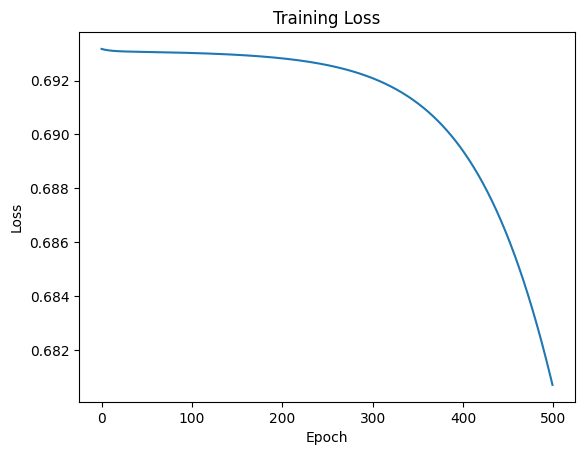
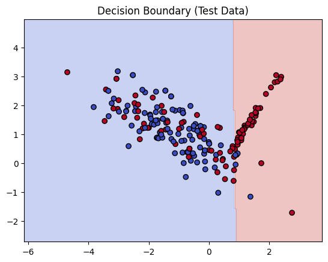
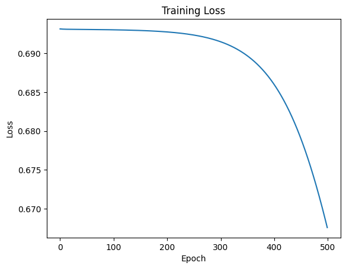
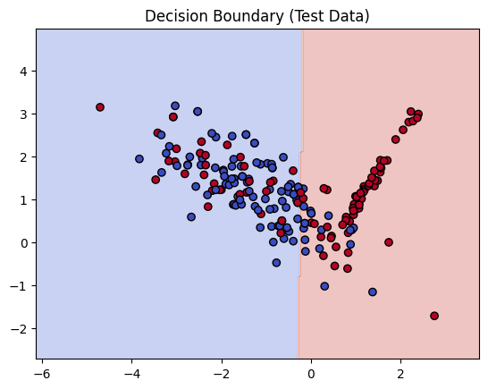
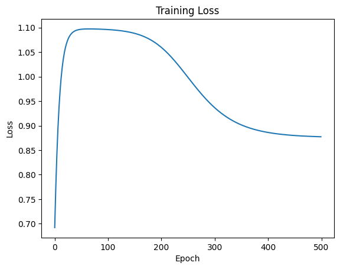
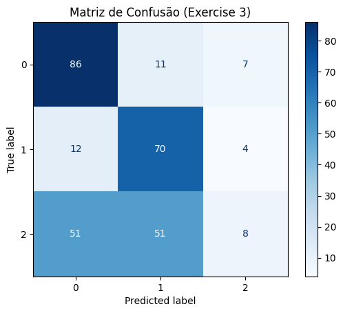

## Objetivo

O objetivo desse roteiro é mostrar a implementação de um perceptron de múltiplas camadas (MLP) sem o uso de toolkits.

## Códigos

Todos os códigos utilizados para fazer esse roteiro podem ser encontrados no repositório, cujo link está na home page desse site. Especificamente para essa entrega, o notebook usado para gerar gráficos e fazer as transformações descritas abaixo pode ser encontrado no path:

```bash
# File Location

notebooks/entrega2/ex.ipynb
```

## Cálculos manuais dos passos de um MLP

- Vetores de Input e output:

    \( \mathbf{x} = [0.5, -0.2] \)

    \( y = 1.0 \)

- Pesos da camada oculta:

    \( \mathbf{W}^{(1)} = \begin{bmatrix} 0.3 & -0.1 \\ 0.2 & 0.4 \end{bmatrix} \)

- Bias da camada oculta:

    \( \mathbf{b}^{(1)} = [0.1, -0.2] \)

- Pesos da camada de output:

    \( \mathbf{W}^{(2)} = [0.5, -0.3] \)

- Bias da camada de output:

    \( b^{(2)} = 0.2 \)

- Taxa de aprendizagem: \( \eta = 0.3 \)

- Função de ativação: \( \tanh \)

### **1. Forward Pass**

#### Computar os valores de pré-ativação da camada oculta

$$
z^{(1)} = W^{(1)}x + b^{(1)}
$$

$$
= \begin{bmatrix} 0.3 & -0.1 \\ 0.2 & 0.4 \end{bmatrix} 
\begin{bmatrix} 0.5 \\ -0.2 \end{bmatrix} 
+ \begin{bmatrix} 0.1 & -0.2 \end{bmatrix}
$$

$$
= \begin{bmatrix} 0.3\cdot0.5 + (-0.1)(-0.2) \\ 0.2\cdot0.5 + 0.4(-0.2) \end{bmatrix}
+ \begin{bmatrix} 0.1 \\ -0.2 \end{bmatrix}
$$

$$
= \begin{bmatrix} 0.15 + 0.02 \\ 0.10 - 0.08 \end{bmatrix} + \begin{bmatrix} 0.1 \\ -0.2 \end{bmatrix}
= \begin{bmatrix} 0.27 \\ -0.18 \end{bmatrix}
$$

---

#### Aplicar tanh para conseguir ativação oculta

$$
h^{(1)} = \tanh(z^{(1)})
$$

$$
h^{(1)} = \begin{bmatrix} \tanh(0.27) \\ \tanh(-0.18) \end{bmatrix}
= \begin{bmatrix} 0.2637 \\ -0.1781 \end{bmatrix}
$$

---

#### Computar os valores de pré-ativação da camada de output

$$
u^{(2)} = W^{(2)}h^{(1)} + b^{(2)}
$$

$$
= [0.5, -0.3] \begin{bmatrix} 0.2637 \\ -0.1781 \end{bmatrix} + 0.2
$$

$$
= (0.5)(0.2637) + (-0.3)(-0.1781) + 0.2
$$

$$
= 0.1319 + 0.0534 + 0.2 = 0.3853
$$

---

#### Ativação do output

$$
\hat{y} = \tanh(u^{(2)}) = \tanh(0.3853) = 0.3672
$$

---

### **2. Loss**

$$
L = \frac{1}{2}(y - \hat{y})^2
= \tfrac{1}{2}(1 - 0.3672)^2
= \tfrac{1}{2}(0.6328^2)
= \tfrac{1}{2}(0.4004)
= 0.2002
$$

---

### **3. Backward Pass**

#### Gradiente da loss wrt saída

$$
\frac{\partial L}{\partial \hat{y}} = -(y - \hat{y}) = -(1 - 0.3672) = -0.6328
$$

#### Gradiente wrt pre-activation de saída

$$
\frac{\partial L}{\partial u^{(2)}} = \frac{\partial L}{\partial \hat{y}} \cdot (1 - \hat{y}^2)
$$

$$
= -0.6328 \cdot (1 - 0.3672^2)
= -0.6328 \cdot (1 - 0.1348)
= -0.6328 \cdot 0.8652
= -0.5475
$$

---

#### Gradientes da camada de saída

* Para pesos:

$$
\frac{\partial L}{\partial W^{(2)}} = \frac{\partial L}{\partial u^{(2)}} \cdot h^{(1)T}
$$

$$
= -0.5475 \cdot [0.2637, -0.1781]
= [-0.1444, 0.0975]
$$

* Para bias:

$$
\frac{\partial L}{\partial b^{(2)}} = \frac{\partial L}{\partial u^{(2)}} = -0.5475
$$

---

#### Gradiente propagado para a hidden

$$
\frac{\partial L}{\partial h^{(1)}} = W^{(2)T} \cdot \frac{\partial L}{\partial u^{(2)}}
$$

$$
= \begin{bmatrix} 0.5 \\ -0.3 \end{bmatrix} (-0.5475)
= \begin{bmatrix} -0.2737 \\ 0.1643 \end{bmatrix}
$$

$$
\frac{\partial L}{\partial z^{(1)}} = \frac{\partial L}{\partial h^{(1)}} \cdot (1 - h^{(1)2})
$$

$$
= \begin{bmatrix} -0.2737 \\ 0.1643 \end{bmatrix} \odot \begin{bmatrix} 1 - 0.2637^2 \\ 1 - (-0.1781)^2 \end{bmatrix}
$$

$$
= \begin{bmatrix} -0.2737 \\ 0.1643 \end{bmatrix} \odot \begin{bmatrix} 0.9305 \\ 0.9683 \end{bmatrix}
= \begin{bmatrix} -0.2546 \\ 0.1590 \end{bmatrix}
$$

---

#### Gradientes da camada oculta

* Para pesos:

$$
\frac{\partial L}{\partial W^{(1)}} = x^T \cdot \frac{\partial L}{\partial z^{(1)}}
$$

$$
= \begin{bmatrix} 0.5 \\ -0.2 \end{bmatrix} \begin{bmatrix} -0.2546 & 0.1590 \end{bmatrix}
$$

$$
= \begin{bmatrix} 0.5(-0.2546) & 0.5(0.1590) \\ -0.2(-0.2546) & -0.2(0.1590) \end{bmatrix}
= \begin{bmatrix} -0.1273 & 0.0795 \\ 0.0509 & -0.0318 \end{bmatrix}
$$

* Para bias:

$$
\frac{\partial L}{\partial b^{(1)}} = \frac{\partial L}{\partial z^{(1)}} = [-0.2546, 0.1590]
$$

---

### **4. Parameter Update** (η = 0.1)

* Saída:

$$
W^{(2)}_{\text{new}} = [0.5, -0.3] - 0.1[-0.1444, 0.0975]
= [0.5144, -0.3098]
$$

$$
b^{(2)}_{\text{new}} = 0.2 - 0.1(-0.5475) = 0.2548
$$

---

* Oculta:

$$
W^{(1)}_{\text{new}} = \begin{bmatrix} 0.3 & -0.1 \\ 0.2 & 0.4 \end{bmatrix} - 0.1 \begin{bmatrix} -0.1273 & 0.0795 \\ 0.0509 & -0.0318 \end{bmatrix}
$$

$$
= \begin{bmatrix} 0.3127 & -0.1079 \\ 0.1950 & 0.4032 \end{bmatrix}
$$

$$
b^{(1)}_{\text{new}} = [0.1, -0.2] - 0.1[-0.2546, 0.1590]
= [0.1255, -0.2159]
$$

## Classificação binária com dados sintéticos e MLP

### Gerando os dados

Os dados utilizados foram feitos usando a função make classification do scikit-learn. O objetivo foi gerar 1000 amostras, igualmente divididas entre 2 classes, uma das classes com 1 cluster e a outra com 2. De modo a atingir isso, foram feitas 2 chamadas diferentes, uma com o parametro `n_clusters_per_class` igual a 1, enquanto na outra igual 2. Além disso as amostras tinham 2 features.

Esses dados foram separados em treino (80%) e teste (20%)

### Construindo a MLP

O propósito desse primeiro MLP, foi desenvolver uma rede neural mais básica, com apenas 1 camada oculta, usando a sigmoide como função de ativação, perfeita devido à quantidade de classes (2), visto que retorna um valor entre 0 e 1. Como função de loss optei pela Binary Cross-Entropy, visto que esse cálculo foi criado para medir a diferença entre duas distribuições de probabilidade (valores entre 0 e 1). Como otimizador optei pela descida pelo gradiente por ser mais básica e fácil de se implementar. Em relação ao número de neurônios testei as seguintes disposições : 

$$
= \begin{bmatrix}2 & 4 & 1 \end{bmatrix}
$$

$$
= \begin{bmatrix}2 & 8 & 1 \end{bmatrix}
$$

A diferença entre as duas disposições será mostrada nos resultados.

De modo a permitir a reprodução e adaptação da MLP, as implementações foram feitas por meio de funções. Os pesos e biases foram inicializados aleatoriamente, usando a função randn do numpy, que gera um valor aleatório entre 0 e 1. Como taxa de aprendizado optei por usar 0.1, e o treinamento foi feito ao decorrer de 500 epochs.

### Resultados

Acurácia: 0.67

- lr = 0.1, 4 neurônios na oculta


/// caption
Variação do Loss ao decorrer do treino
///

/// caption
Decision Boundary que o modelo chegou
///

- lr = 0.1, 8 neurônios na oculta

Acurácia: 0.715


/// caption
Variação do Loss ao decorrer do treino
///

/// caption
Decision Boundary que o modelo chegou
///

## Classificação multiclasse com dados sintéticos e MLP

### Gerando os dados

Os dados utilizados foram feitos usando a função make classification do scikit-learn. O objetivo foi gerar 1500 amostras, igualmente divididas entre 3 classes, a primeira com 2 clusters, a segunda com 3 e a última com 4. De modo a atingir isso, foram feitas 3 chamadas diferentes, cada uma com o valor mencionado acima de clusters. Além disso as amostras tinham 4 features.

Esses dados foram separados em treino (80%) e teste (20%)

### Construindo a MLP

Como mencionado anteriormente, a implementação anterior buscou permitir a reutilização das funções, de modo a fazer isso, a função MLP, que inicializa os pesos e bias iniciais, recebe um parâmetro chamado loss_type, que diferencia quando será usada a Binary Cross-Entropy (2 classes) de quando a função de loss será a Categorical Cross-Entropy. Optei por usar Categorical Cross-Entropy, visto que essa função generaliza as probabilidades quando existem mais de 2 classes. No caso da Binary Cross-Entropy, ela poderia resultar em uma distribuição de probabilidades inválidas, já que trata cada neurônio como "pertence ou não a essa classe", tem uma visão binária.  

Outro ponto é que os labels Y passam por um one-hot encoding, de modo que para a primeira classe temos uma matriz com [1,0,0], para a segunda [0,1,0], e assim em diante. Isso implica que no backward pass foi necessário adicionar um constraint, visto que para a versão com duas classes era feito um reshape em Y, permitindo que a multiplicação matricial fosse possível.

Além disso, como temos 3 possíveis outputs, a última camada possui como ativação uma função softmax, que baseada nos valores recebidos dos neurônios, retorna probabilidades válidas, e ao fazer o predict apenas selecionamos a classe com maior probabilidade.

Como parâmetro da MLP temos:

- Quantidade de neurônios

$$
= \begin{bmatrix}4 & 16 & 3 \end{bmatrix}
$$

- 500 epochs

- learning rate = 0.1

- Pesos e biases inicializados aleatoriamente.

### Resultados

- Acurácia : 0.546


/// caption
Variação do Loss ao decorrer do treino
///

/// caption
Decision Boundary que o modelo chegou
///

Vale ressaltar que nesse caso, o plot de decision boundary não faz sentido, visto que não seria possível visualizar todas as dimensões que os dados possuem, por isso, optei por utilizar a matriz de confusão.