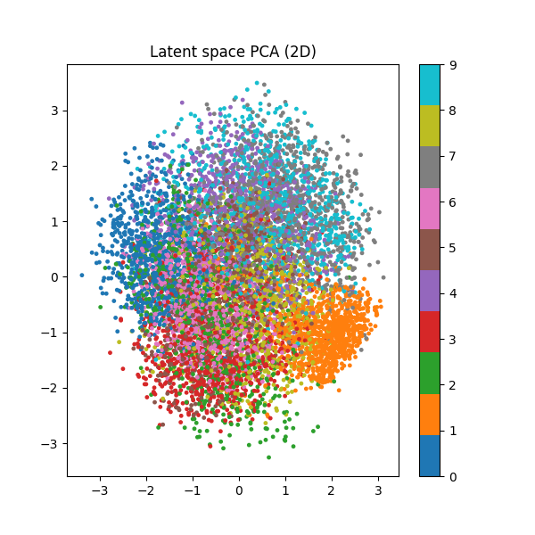
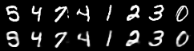
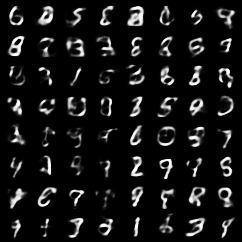

# Relatório – Implementação de um Variational Autoencoder (VAE)

## Objetivo

O objetivo desse roteiro é relatar o processo de desenvolvimento de um Variational Autoencoder (VAE) aplicado ao dataset **MNIST**, composto por imagens de dígitos manuscritos. O VAE é um modelo generativo capaz de aprender representações latentes e gerar novas amostras a partir de um espaço contínuo.

## Códigos

Os códigos utilizados neste experimento podem ser encontrados no repositório principal.
O script principal utilizado está localizado em:

```bash
# File Location
notebooks/entrega4/ex4.py
```

O modelo da rede neural está definido no arquivo:

```bash
models/model.py
```

---

## Preparação do Dataset

Foi utilizado o dataset **MNIST**, importado diretamente do módulo `torchvision.datasets`.
Durante o carregamento, aplicou-se a transformação `transforms.ToTensor()`, que converte as imagens para tensores e normaliza os valores de pixel no intervalo [0, 1].

O dataset foi dividido em três subconjuntos:

* **Treinamento:** 85% dos dados originais.
* **Validação:** 15% dos dados de treino, separação feita via `train_test_split` com `random_state=42`.
* **Teste:** conjunto padrão de teste do MNIST.

O carregamento foi feito por meio do `DataLoader` do PyTorch, com **batch size de 64** e embaralhamento dos lotes (`shuffle=True`).

---

## Implementação do Modelo

O VAE foi implementado como uma subclasse de `torch.nn.Module`, conforme o arquivo `model.py`.

### Estrutura do Encoder

O encoder é composto por:

* Uma camada linear que reduz o vetor de entrada (784 neurônios, correspondentes aos 28×28 pixels da imagem) para 400 unidades.
* Duas camadas lineares paralelas:

  * `hid_mu`: produz o vetor **μ** (média) do espaço latente.
  * `hid_sigma`: produz o vetor **σ** (desvio padrão) do espaço latente.

A função de ativação utilizada é **ReLU**.

### Reparametrization Trick

O código implementa o truque de reparametrização conforme: z = μ + σ · ε,  ε ~ N(0, I). Isso permite que o gradiente flua através de μ e σ durante o treinamento, essencial para o aprendizado estável do VAE.

### Estrutura do Decoder

O decoder reconstrói a imagem a partir de `z` com:

* Uma camada linear de `latent_dim → hidden_dim`;
* Uma camada de saída `hidden_dim → input_dim`;
* Função de ativação **sigmoid**, que garante saídas no intervalo [0, 1].

---

## Processo de Treinamento

O treinamento foi implementado no arquivo `ex4.py`.
O modelo foi treinado por **50 épocas**, utilizando o otimizador **Adam** com taxa de aprendizado (`LR`) de `1e-4` e weight decay (`L2 Regularization`) de `1e-5`.

A função de perda combina:

1. **Binary Cross-Entropy (BCE):** mede a qualidade da reconstrução das imagens.
2. **Kullback-Leibler Divergence (KLD):** regulariza o espaço latente para aproximar uma distribuição normal padrão.

A função total de perda é dada por:
[
\mathcal{L} = \text{BCE} + \text{KLD}
]
Durante o treinamento, as perdas médias (total, BCE e KLD) são impressas a cada época.

Após cada época:

* O modelo é salvo em `./checkpoints`;
* Amostras reconstruídas e novas amostras do espaço latente são salvas nas pastas `./reconstructions` e `./samples`, respectivamente.

---

## Avaliação do Modelo

Após o treinamento, o modelo é avaliado sobre o conjunto de **validação** e **teste**.
A métrica de avaliação utilizada é a **perda média por amostra** (BCE + KLD).

Além disso, é feita uma análise qualitativa:

* Reconstruções de imagens do conjunto de validação;
* Amostras sintéticas geradas a partir de vetores `z` aleatórios (`torch.randn`).

Essas imagens permitem verificar a capacidade do modelo em aprender a estrutura dos dígitos e gerar variações plausíveis.

---

## Visualização do Espaço Latente

Para interpretar o espaço latente de dimensão 40, aplicou-se o método **PCA (Principal Component Analysis)**, reduzindo-o para 2 dimensões.
O resultado é visualizado em um gráfico de dispersão, onde cada ponto representa uma imagem do conjunto de validação, colorido conforme sua classe verdadeira (0–9).


/// caption
Plot do espaço latente após a realização de um PCA.
///

Esse tipo de visualização permite observar como o VAE organizou semanticamente as representações dos dígitos no espaço latente.

---

## Resultados e Observações

* O VAE foi capaz de **reconstruir bem** as imagens do MNIST, especialmente após as primeiras 10–15 épocas.
* O **termo KLD** tende a ser menor que a BCE, indicando que o modelo aprendeu uma distribuição latente razoavelmente suave.
* A **qualidade das amostras geradas** melhora progressivamente, demonstrando que o espaço latente se torna mais estruturado com o treinamento.
* A redução via PCA mostrou **agrupamentos visíveis** entre classes semelhantes (por exemplo, 9 e 4 próximos, 0 e 6 próximos).


/// caption
Reconstruções feitas pelo modelo, a partir de exemplos presentes no dataset.
///

Na imagem acima, a linha de cima representa a imagem original no dataset, e a imagem abaixo representa a reconstrução do que o modelo construiu.


/// caption
Construção de samples a partir de distribuições aleatórias.
///

Como pode se observar, a reconstrução obteve um resultado muito melhor do que os samples gerados pelo VAE. 

---

## Conclusão

A implementação do VAE no dataset MNIST mostrou-se eficiente para reconstruir imagens de dígitos, mas não tanto para gerar samples.
A arquitetura simples com um espaço latente de 40 dimensões foi suficiente para capturar as principais variações do dataset.

O exercício permitiu compreender os principais componentes de um VAE:

* O papel da divergência KL na regularização do espaço latente;
* A importância da reparametrização para permitir o backpropagation;
* A utilidade da análise visual do espaço latente.

---